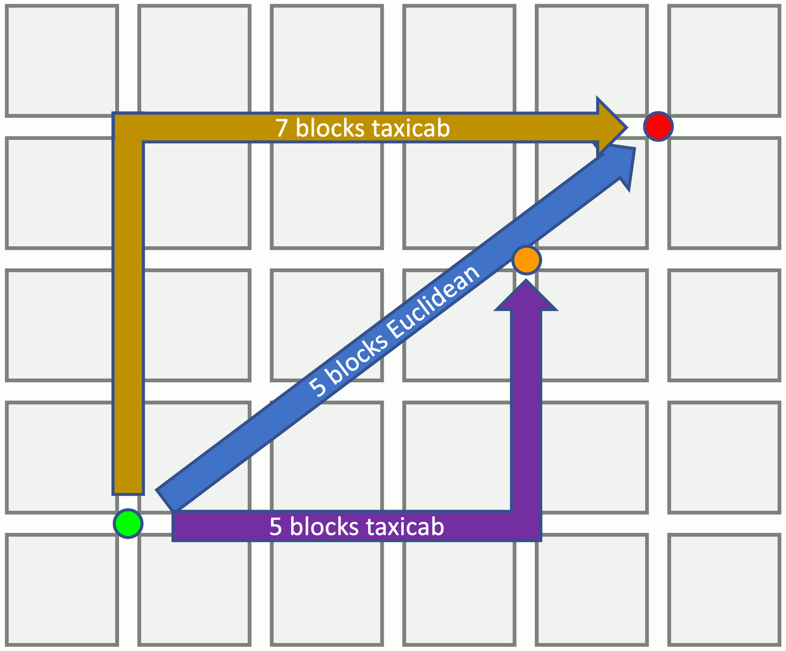

## Escenarios
Se propone almacenar a los escenarios como una matriz 16x16 de structs para cada modulo
```c
typedef struct {
    int tipo;
    int altura;
    int objeto;
} Modulo

Modulo* escenario[16];

escenario[i][16];

escenario[i][j] = Modulo
```
Alternativamente, se puede crear un mapa basado en punteros entre structs
```c
typedef struct {
    int tipo;
    int altura;
    struct* personaje;

    struct* arriba;
    struct* abajo;
    struct* izquierda;
    struct* derecha;
} Modulo
```

Ademas, cada Modulo tiene tres valores:
### Tipo
Cada Modulo tiene asignado un numero correspondiente al tipo de espacio que es
1. (0) Espacio normal
2. (1) Espacio de partida. Un jugador aparece aqui. Existen solo dos espacios de partida.
3. (2) Espacio objetivo. Este es el objetivo donde deben llegar los jugadores

### Altura
Cada Modulo tiene una altura asociada. Los jugadores solo pueden moverse a un espacio si tienen un maximo de 2 metros de diferencia entre el espacio en el que se encuentran y el espacio al que desean moverse. La altura maxima es de 5 metros.

### Personaje
Cada Espacio podra alojar a un personaje como maximo, con un puntero al struct del personaje. Mas informacion en la seccion sobre los personajes.

## Limitaciones
### Modulos
Cada modulo debera tener al menos un modulo adyacente con una diferencia de altura de 1 metro con respecto a su propia altura.

### Lugar de Partida
Cada jugador debera partir a una distancia taxista de por lo menos 4 modulos
<div style="text-align: center;">
    
</div>

### Movimiento
Los jugadores solo se podran mover de izquierda a derecha o de arriba a abajo, sin movimiento diagonal. Ademas, solo se podran mover a modulos con a lo mas una diferencia de altura de 2 metros con respecto al modulo en el que se encuentran.

### Camino valido
Considerando las restricciones anteriores, cada jugador debe tener por lo menos un camino valido para llegar desde su punto de partida hasta el punto objectivo del mapa

## Personajes
Se propone representar a los personajes como structs que almacenan que personaje es y los dispositivos a su disposicion

```c
typedef struct {
    int tipo;
    int dispositivos[3];
} Personaje
```

### Personaje
Cada Personaje tendra un tipo entero que representara si el personaje es Megaman (rockman) o Protoman
1. (0) Megaman (rockman)
2. (1) Protoman

### Dispositivos
Cada Personaje tendra una lista de enteros que representan los dispositivos a disposicion de cada jugador. Mas informacion sobre los dispositivos en la seccion dedicada a ellos.

## Dispositivos
Cada jugador tendra que seleccionar tres dispositivos al comienzo de la partida, con una eleccion al azar para decidir quien elige primero. Se propone que se turne la eleccion de dispositivos. Es decir, por el azar elige primero B, luego A, luego B, luego A, etc.

### Uso de dispositivos
Los dispositivos requeriran ser preparados por un turno antes de uso, durante el cual tendran que jugar un mini-juego que tendran que ganar para preparar los dispositivos de forma correcta. Si es que se falla el mini-juego, el dispositivo queda inhabilitado para el resto de la partida.

### Gaius (0)
El jugador selecciona **hasta** tres modulos para elegir si subirlos o bajarlos de altura, con cada modulo por separado y no se pueden modificar las alturas fuera del rango establecido \[0-5]

### Quadratus (1)
El jugador elige uno de los dispositivos de su oponente para bloquear su uso durante el resto de la partida. Al fallar, Quadratus no se podra volver a utilizar.

### Hydrus (2)
Al usar este dispositivo, se impide el movimiento del oponente por el turno. Sin embargo, este todavia podra seleccionar un dispositivo para usar durante su siguiente turno.

### Phalanx (3)
El jugador podra subir desde su modulo actual a uno hasta 3 metros arriba suya, en vez de solo 2.

### Argus (4)
Da la posibilidad de cambiar un dispositivo que el jugador todavia no haya usado, por uno que el oponente no haya seleccionado.

## Inteligencia Artificial
### Seleccion de Dispositivos
En caso de elegir la IA primero, selecciona sus tres dispositivos de forma aleatoria. En caso contrario tiene este comportamiento:
1. Su primer dispositivo es uno de los tres seleccionados por el usuario
2. Su segundo dispositivo es uno de los dos que no fueron seleccionados por el usuario
3. Su tercer dispositivo es uno al azar entre los tres que todavia no han sido seleccionados por la IA

### Movimiento
Considerando las restricciones de movimiento, la IA siempre se movera cuando su distancia taxista hasta el objetivo sea menor o igual a la distancia taxista entre el usuario y el objetivo, o no pueda activar ningun dispositivo. Ademas, la IA nunca se rendira, al menos que no exista un camino valido hasta el objetivo, provocado por el uso de dispositivos de parte del usuario.

### Uso de dispositivos
Si es que la IA decide usar un dispositivo, siempe sera uno al azar. La IA siempre utilizara un dispositivo en caso de no poder moverse y tener un camino valido al objetivo.